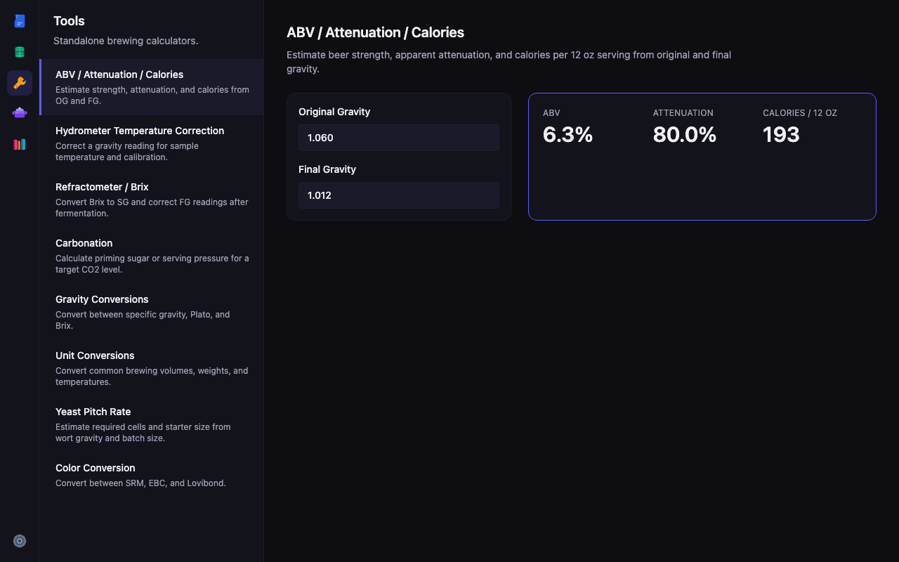
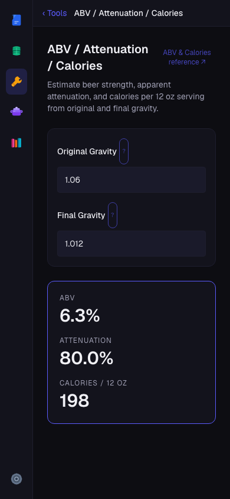
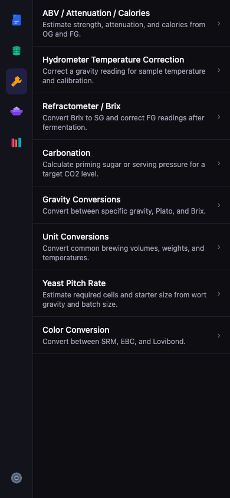
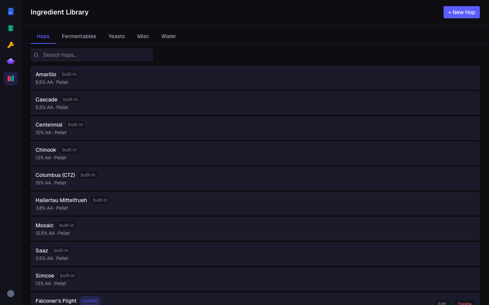
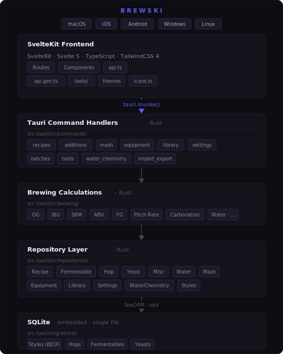

<p align="center">
  
</p>

<p align="center">
  <a href="https://github.com/shanehead/brewski/actions/workflows/ci.yml"></a>
  <a href="https://github.com/shanehead/brewski/releases"></a>
  
  <a href="LICENSE"></a>
  
</p>

# Brewski

Brewski is a sleek and modern homebrewing app for managing recipes, tracking brew days, and dialing in your process. Build recipes, log brew days, work out your water chemistry, and keep notes along the way.

Everything stays on your device, no account needed. Runs on macOS, iOS, Android, Windows, and Linux. Free and open source forever for *all* functionality, no paywalls.

## Features

**🍻 Recipes**
- Build recipes from scratch with full ingredient control — fermentables, hops, yeast, and water additions
- Real-time stats as you build: OG, FG, ABV, IBU, SRM color
- Version history so you can track changes across brew days

**📋 Batch tracking**
- Log brew days against any recipe
- Track fermentation progress and carbonation
- Record notes at every stage

**💧 Water chemistry**
- Model your water source and target profiles
- Calculate mineral additions (gypsum, calcium chloride, etc.)
- See adjusted water chemistry before you brew

**🌡️ Mash**
- Build multi-step mash schedules
- Track temperatures and times

**📦 Ingredient library**
- Searchable database of hops, fermentables, and yeasts
- Data sourced from [BeerMaverick](https://beermaverick.com)

**🔧 Brewing tools**
- ABV & calorie calculator
- Carbonation calculator
- Gravity conversions
- Hydrometer temperature correction
- Pitch rate calculator
- Refractometer correction
- Unit conversions

**⚙️ Equipment profiles**
- Save your system's volumes and efficiency for accurate recipe scaling

## Screenshots

<table>
  <tr>
    <td align="center" width="60%">
      
      <br/><sub>Brewing calculators — desktop</sub>
    </td>
    <td align="center" width="40%">
      
      <br/><sub>Mobile view</sub>
    </td>
  </tr>
  <tr>
    <td align="center" width="60%">
      
      <br/><sub>Recipe list — desktop</sub>
    </td>
    <td align="center" width="40%">
      
      <br/><sub>Tools list — mobile</sub>
    </td>
  </tr>
  <tr>
    <td colspan="2" align="center">
      
      <br/><sub>Ingredient library — Hops, Fermentables, Yeasts, Water profiles</sub>
    </td>
  </tr>
</table>

## Download

Download the latest release for your platform from the [Releases](../../releases) page.

| Platform | Format |
|---|---|
| macOS | `.dmg` (universal — Apple Silicon + Intel) |
| iOS | `.ipa` |
| Android | `.apk` / `.aab` |
| Windows | `.msi` / `.exe` |
| Linux | `.deb` · `.AppImage` · `.rpm` |

## Your data

Brewski stores everything locally — no cloud, no account. Your database lives at:

| Platform | Default path |
|---|---|
| macOS | `~/Library/Application Support/brewski/brewski.db` |
| Windows | `%APPDATA%\brewski\brewski.db` |
| Linux | `~/.local/share/brewski/brewski.db` |
| iOS / Android | App sandbox (export via the app) |

The database path is configurable in Settings. Point it to a folder inside iCloud Drive, Dropbox, Google Drive, or any other sync service to keep your data backed up and in sync across your devices.

---

## For developers

### Architecture

<p align="center">
  
</p>

The frontend is a SvelteKit app running inside Tauri's WebView. All backend access goes through Tauri's IPC bridge via `tauri.invoke()` — typed wrappers live in [`src/lib/api.gen.ts`](src/lib/api.gen.ts). The Rust side handles commands, delegates to a repository layer, and persists everything to an embedded SQLite database via SeaORM and sqlx.

C4 diagrams (System Context, Container, and Component levels) are in [`docs/c4.md`](docs/c4.md).

Design system + brand reference: see [`design/`](./design/README.md)

### Tech Stack

| Layer | Technology |
|---|---|
| Frontend | SvelteKit · Svelte 5 · TypeScript · TailwindCSS 4 |
| Backend | Rust · Tauri 2 |
| IPC | `tauri.invoke()` |
| ORM | SeaORM · sqlx |
| Database | SQLite (embedded, single file) |

### Getting Started

**Prerequisites**

- [Rust](https://rustup.rs/)
- [Bun](https://bun.sh/)
- [Tauri v2 prerequisites](https://v2.tauri.app/start/prerequisites/) for your platform

**Development**

```bash
bun install        # install frontend dependencies
just dev           # Tauri dev server (frontend + backend)
just dev-web       # frontend only (no Rust compilation)
just dev-ios       # iOS simulator (set IOS_SIMULATOR env var to override device)
just dev-android   # Android emulator
```

**Other commands**

```bash
just check          # TypeScript check + OpenAPI lint
just test           # Rust + frontend tests
just lint-openapi   # validate docs/openapi/openapi.yaml
just preview-docs   # render API docs in a browser
```

### API

The full Tauri IPC interface is documented as an OpenAPI 3.1 spec at [`docs/openapi/openapi.yaml`](docs/openapi/openapi.yaml).

### Contributing

Commits follow [Conventional Commits](https://www.conventionalcommits.org/) style: `type(scope): description` (e.g. `feat(recipes): add clone command`, `fix(ibu): correct rager formula`).

## License

MIT — see [LICENSE](LICENSE).
