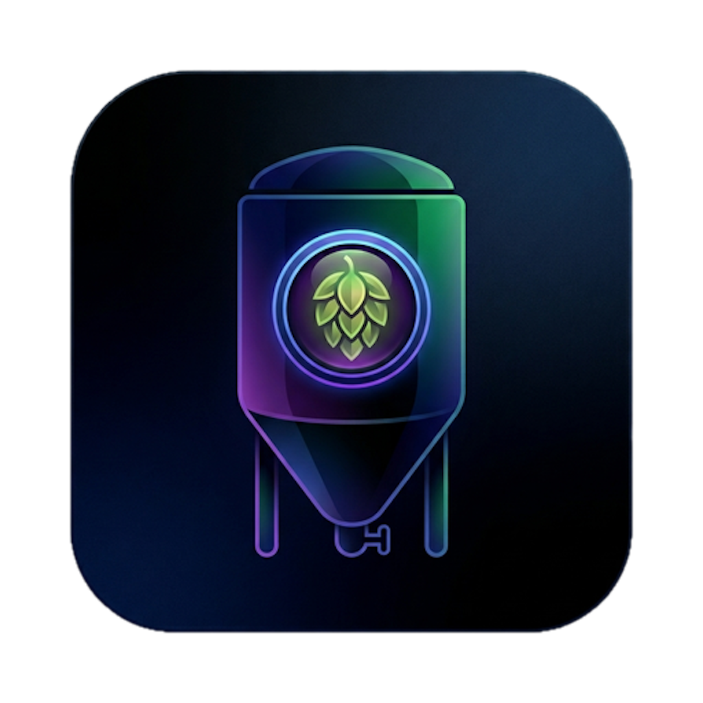

# Brewski Design System

<p align="center">
  
</p>

> **Brewski** is a sleek, modern, free and open-source home-brewing app. Recipes, brew-day logs, water chemistry, fermentation tracking, and calculators — all of it on your device, no account, no cloud, no paywall.

Brewski is built as a single Tauri 2 app that targets **macOS, iOS, Android, Windows and Linux** from a single SvelteKit + Rust codebase. The interface is deliberately quiet: a thin icon rail on desktop, a four-tab bar on mobile, and per-screen tab bars for everything else. The brand identity is **dark by default, vivid accents, fully themable** — the user can swap between 10 built-in color schemes (Midnight, Tokyo Night, Dracula, Catppuccin, Nord, Monokai, plus light variants).

This folder is the design system that lets a designer or design agent generate well-branded Brewski screens, marketing, slides, prototypes, or production code without having to read the source repo every time.

---

## Sources

This system was built from:

- **GitHub:** [shanehead/brewski](https://github.com/shanehead/brewski) — primary source of truth. SvelteKit + Svelte 5 frontend, Rust/Tauri 2 backend, SQLite via SeaORM. Browse [`src/lib/components`](https://github.com/shanehead/brewski/tree/main/src/lib/components), [`src/lib/desktop`](https://github.com/shanehead/brewski/tree/main/src/lib/desktop), [`src/lib/mobile`](https://github.com/shanehead/brewski/tree/main/src/lib/mobile), and the [`src/themes`](https://github.com/shanehead/brewski/tree/main/src/themes) folder if you want to dig deeper.
- **Logo:** [logo.png](https://github.com/shanehead/brewski/blob/main/logo.png) — copied into `assets/brewski-logo.png`.
- **Icon set:** [src/lib/icons.ts](https://github.com/shanehead/brewski/blob/main/src/lib/icons.ts) — 15 hand-crafted multi-color brewing icons. Reproduced verbatim in `assets/icons.ts` and `assets/icons.html`.

> If you're iterating on this system, **read the original Svelte components** before redesigning anything. Screenshots are lossy. The components above contain exact spacing, colors, motion, and accessibility decisions.

---

## Index

```
.
├── README.md                  ← you are here
├── SKILL.md                   ← Claude Code / Agent Skills entry point
├── colors_and_type.css        ← all design tokens + 10 themes + @font-face
├── fonts/                     ← brand type (Geist + Geist Mono variable WOFF2 + OFL license)
├── assets/
│   ├── brewski-logo.png       ← app logo (1024×1024)
│   ├── favicon.png            ← tab icon
│   ├── icons.ts               ← the 15 brewing icons (TS source)
│   └── icons.html             ← icons rendered for browsing
├── preview/                   ← Design System tab cards
│   ├── brand-logo.html
│   ├── colors-themes.html
│   ├── colors-surface-tokens.html
│   ├── colors-text-tokens.html
│   ├── colors-srm-scale.html
│   ├── colors-status.html
│   ├── colors-ingredients.html
│   ├── type-scale.html
│   ├── type-stat-numerals.html
│   ├── type-semantic.html
│   ├── spacing-radius.html
│   ├── spacing-shadow.html
│   ├── components-buttons.html
│   ├── components-inputs.html
│   ├── components-stat-card.html
│   ├── components-list-row.html
│   ├── components-status-pill.html
│   ├── components-nav-rail.html
│   ├── components-tab-bar.html
│   └── components-card.html
└── ui_kits/
    └── brewski-desktop/       ← desktop Tauri shell, full clickable
        ├── README.md
        ├── index.html
        ├── theme.css
        ├── AppShell.jsx
        ├── BrewingIcon.jsx
        ├── Card.jsx
        ├── StatPill.jsx
        ├── StatsSidebar.jsx
        ├── RecipeList.jsx
        ├── TabBar.jsx
        ├── OverviewTab.jsx
        └── ToolView.jsx
```

---

## Content fundamentals

Brewski's voice is **understated, technical, and second-person**. It talks like a fellow brewer who happens to be the app — competent, brief, no hype. There's a single trailing tagline (*"Free and open source forever, no paywalls"*), but otherwise no marketing voice anywhere in the product.

### Tone

- **You, not we.** UI copy never refers to a company. "*Your data*", "*your device*", "*your system's volumes*".
- **Sentence case throughout.** Buttons, tabs, headings — everything is sentence case (`New Recipe`, `Save Version`, `Add ingredients to see stats`). Only the embedded brewing acronyms break this: **OG**, **FG**, **ABV**, **IBU**, **SRM**, **BU:GU**.
- **Brewing acronyms are sacred.** OG/FG/ABV/IBU/SRM are the language of brewing — never spell them out in UI. The repo's [style guide](https://github.com/shanehead/brewski/blob/main/AGENTS.md#variable-naming) is explicit: keep universal brewing acronyms, expand everything else (`volume_gallons`, not `vol_gal`).
- **The word is *addition*, not *ingredient*.** A "hop addition at 60 minutes" is a process event, not a static ingredient. Use `addition` for recipe line items; reserve `ingredient` for the library/database side.
- **Imperative buttons, plain nouns for nav.** `+ New Recipe`, `Import BeerXML`, `Save Version`, `Branch from here`, `Delete`. Nav uses bare nouns: `Recipes`, `Batches`, `Tools`, `Equipment`, `Library`, `Settings`.
- **No emoji in UI.** The README uses a small set (🍻 📋 💧 🌡️ 📦 🔧 ⚙️) for marketing-style feature lists, but no emoji appears inside the running app. Iconography is the SVG brewing icon set; that's the brand mark.
- **Empty states are short and matter-of-fact.** Not motivational. Examples:
  - `Select a recipe to edit`
  - `Add ingredients to see stats`
  - `No batches yet`
  - `No batches yet. Tap + to start one.` (mobile only — adds the input hint)
  - `Select a tool from the list`
- **Saving feedback is a whisper, not a popup.** `Saving…` in muted small text. There are no success toasts; the only floating message in the app is `lastError`, surfaced briefly at the bottom of the screen with `✕` to dismiss.
- **Numbers are unit-suffixed and rendered with explicit zero values.** `OG 1.052` (3 decimals), `ABV 5.2%` (1 decimal), `IBU 38` (integer), `SRM 5.4` (1 decimal). Volumes auto-switch between metric (`L`) and imperial (`gal`) via the units setting. When a value is unknown the cell reads `—` (em dash), never `null` or blank.
- **Confirmations use natural language with the consequence baked in.** `Delete v3 "Hop bomb"? This cannot be undone.` / `Replace your current recipe with v3's data? This cannot be undone.` — no "Are you sure?", just the action and the cost.

### Casing reference

| Element                  | Casing                                            |
| ------------------------ | ------------------------------------------------- |
| Nav labels               | Title case nouns — `Recipes`, `Batches`           |
| Page titles              | Title case — `Ingredient Library`, `Settings`     |
| Section titles in cards  | Title case — `Recipe Details`, `Volumes & Timing` |
| Eyebrow labels in cards  | UPPERCASE, wide tracking — `STATS`, `VOLUMES`     |
| Buttons                  | Sentence case — `Save Version`, `+ New Recipe`    |
| Form labels              | Title case short — `Batch Size`, `Boil Time (min)`|
| Status pills             | Title case — `Planned`, `Brewing`, `Fermenting`   |
| Tab labels               | Title case — `Overview`, `Ingredients`, `Mash`    |
| Acronyms (OG/FG/ABV…)    | ALL CAPS, always                                  |

---

## Visual foundations

### Color philosophy

The whole product runs on **9 CSS variables**: `--color-bg-base`, `--color-bg-surface`, `--color-bg-elevated`, `--color-border`, `--color-accent`, `--color-accent-hover`, `--color-text-primary`, `--color-text-secondary`, `--color-text-muted`. Themes swap these; nothing else changes. Never hard-code a brand color in a Brewski design — go through the tokens.

A handful of colors live **outside** the theme: SRM beer-color stops (1°–40°), batch status colors (planned / brewing / fermenting / packaged / complete), and the ingredient category accents on the brewing icons. These are physical/semantic and must stay constant across light and dark.

The **default identity is Midnight**: near-black backgrounds (`#0d0d12` → `#13131c` → `#1a1a2a`) with an indigo-violet accent (`#5c5cff`). When a user lands without a theme set, this is what they see. Marketing assets, the app icon, and OG images should all be designed against Midnight first.

### Backgrounds

- **Flat color, layered by elevation.** Three tiers: page (`--color-bg-base`), panel/sidebar/header (`--color-bg-surface`), card/input/hover (`--color-bg-elevated`). The whole UI is built by stacking these flat tones — borders, not shadows, separate them.
- **No gradients in product UI.** The single allowed gradient is on the app icon (the indigo→purple→green fermenter glow). Don't introduce gradient backgrounds in screens or marketing.
- **No background images, patterns, or textures.** Brewski's chrome is intentionally flat. Imagery only appears in product photography contexts (download page, marketing); the app itself has none.
- **No full-bleed hero imagery in product.** Even the empty states are typography.

### Animation

- **Quick and quiet.** All transitions are `transition-colors` only — color and background interpolation, ~120–180ms. There are no entrance animations, slide-ups, scales, or springs.
- **No bounces.** No `cubic-bezier` overshoots. Use `cubic-bezier(0.2, 0, 0, 1)` (the system standard) or just default `ease`.
- **Opacity is the workhorse hover.** Sidebar delete buttons, tab icons, etc. swap opacity (0.45 → 1.0) on hover. No color shifts on most icons.

### Hover / press states

- **Buttons:** stay the same color on hover. The accent button uses `--color-accent` flat; on hover it shifts to `--color-accent-hover`. Secondary buttons get `hover:opacity-80` or a subtle elevation bump to `--color-bg-elevated`.
- **Nav items:** active state = background tinted with the accent at ~18% opacity (`color-mix(in srgb, var(--color-accent) 18%, transparent)`). Inactive items have no hover background — just an opacity bump on the icon.
- **List rows:** hover → `--color-bg-elevated`. Selected → `--color-bg-elevated` **plus** a 2px left-border accent stripe (the border eats 2px of left padding to avoid layout shift).
- **Icon-only buttons / X-to-delete:** `opacity: 0.4` resting, `opacity: 1.0` on hover. No background.
- **Press states:** none beyond the hover state — Tauri's webview doesn't get a meaningful `:active`, so we don't design for one.

### Borders

- **1px, always.** The product uses a single border weight everywhere: `1px solid var(--color-border)`. The only exception is the selected-recipe stripe (2px left border) and active tabs (2px bottom border).
- **Hair-thin dividers between every elevation change.** Header → content, sidebar → main, tab → content — all are 1px theme-aware borders. This is more important than shadows for the dark-mode look.
- **Selected accent borders.** Active tab and selected list row use a 2px stripe in `--color-accent`. The tool sidebar uses a 3px left border on the active route.

### Shadows

- **Borders > shadows, almost always.** Shadows only appear on floating UI: the Save Version popover, the modal sheet (`ConfirmModal`), the error toast.
- **Soft and dark.** Defined in `colors_and_type.css` as `--shadow-sm/-md/-lg` with `rgba(0,0,0, 0.18 → 0.45)`. They're tuned for Midnight; on light themes they stay subtle.
- **No inner shadows. No glow effects.**

### Layout rules

- **Desktop is a three-column shell:** 56px icon rail · 224px sidebar list · flexible main · optional 176px stats rail. Heights are `100vh` exactly with `overflow: hidden` on the root and `overflow-y: auto` only on inner scroll regions.
- **Mobile is single-column** with a `100dvh` shell (not `100vh` — handles iOS URL bar resizing), `env(safe-area-inset-top/bottom)` padding, a fixed-height bottom tab bar (4 items), and **44px minimum tap targets** (declared globally via `app.css`).
- **Cards have a header strip.** A `Card` is `--color-bg-surface` with a top strip containing an UPPERCASE eyebrow label, divider, then content padded 16px. They have no shadow.
- **Stat cards differ.** Smaller (`--color-bg-elevated`), inside the right rail; eyebrow + big mono number, with an optional progress bar.
- **Side rails always carry their own background.** The 56px icon rail and 224px sidebar are `--color-bg-surface`; the main pane is `--color-bg-base`. This is the primary depth cue.

### Corner radii

- `--radius-sm` (4px): badges, status pills (`px-1.5 py-0.5 rounded`)
- `--radius-md` (6px / Tailwind `rounded`): buttons, inputs, list rows, nav rail tiles, search bar
- `--radius-lg` (8px / Tailwind `rounded-lg`): stat cards, popovers
- `--radius-xl` (12px / Tailwind `rounded-xl`): main `Card` component, modal sheets
- `--radius-full` only for tiny pill badges (e.g. the `built-in` library tag)

Avoid `rounded-2xl` or larger. No sharp/right-angle UI either — everything has at least 4px of softening.

### Transparency & blur

- **Transparency is rare.** Used in three places:
  1. Active nav-rail tile background — accent at 18% opacity via `color-mix`.
  2. Library badge backgrounds — accent at 15% opacity.
  3. Modal scrim — `rgba(0,0,0,0.5)` flat black.
- **No `backdrop-filter: blur` anywhere.** No frosted glass effects. The product is designed to work on the Tauri webview, which has inconsistent blur support across platforms.

### Imagery vibe

- The **only piece of brand imagery** is the app logo: a fermentation tank in moody navy/purple with a glowing green hop cone in the porthole. It's dark, slightly luminous around the edges, with electric blue and lime green highlights — that's the brand's color DNA.
- Photography (if it appears in marketing): **moody, low-key, cool, in-process** — a glass carboy half full, condensation, kitchen counters under warm lights, no people, no clinking glasses. Avoid stock-y "cheers" shots.
- The favicon is the same hop+tank glyph on a transparent background.

---

## Iconography

Brewski uses a **bespoke set of 15 multi-color SVG icons** defined in `src/lib/icons.ts` (copied to `assets/icons.ts` and rendered in `assets/icons.html`). They live in one file as a typed dictionary; the `<BrewingIcon name="hop" size={22} />` Svelte component (`src/lib/components/BrewingIcon.svelte`) renders them inside a single 24×24 viewBox SVG with `aria-hidden="true"`.

### Icon set

```
recipes      batches     tools       equipment   library     settings
overview     ingredients mash        water       fermentation notes      batches
fermentable  hop         yeast
```

### Style traits

- **24×24 viewBox**, drawn flat and front-on.
- **Fill-based, not stroke-based.** A typical icon has 3–6 layered `<path>`s in different fills to create cheap depth — e.g. a kettle has a body fill, a darker fill for the "right half" (50% shaded), a lighter highlight, and a single small detail (steam, bubble, label).
- **Bright, slightly oversaturated palette** — Tailwind 500/600/700 tones. Hops are emerald-green, water is sky-blue, fermentation is violet, fermentables/notes are amber, tools are orange-amber, recipes are blue, library/equipment is multi-color (book spines / purple kettle).
- **Hand-illustrated, not abstract glyphs.** Each one is a tiny illustration of a real brewing object: a recipe book, a kettle, a fermenter, a yeast flask. There are no generic icons (no abstract "doc" or "gear" shapes — the settings icon is a literal mechanical gear with bevels).
- **Layered without strokes.** Inner highlights / shadows use `opacity` on white overlays rather than gradients.
- **No outline / stroke variants.** Brewski only has the filled set.

### Usage rules

- **Size 18–22 in chrome** (nav rail, tab bar) — the components default to 18, the desktop rail uses 22.
- **Selected = full opacity 1.0; unselected = 0.45 opacity.** The icon itself doesn't change color — only opacity flips. This applies in the bottom tab bar and the recipe-tab bar.
- **Inside flow content** (e.g. a settings row caret), use plain inline SVG (`stroke="currentColor"`) — Feather-style line glyphs. These are not part of the brewing icon set and are written inline in components. The settings page caret and search-input magnifier are the only two examples in the live app.
- **Never recolor a brewing icon.** The colors carry meaning (hops green, water blue). If you need a single-tone version, fall back to a Feather-style line icon instead.
- **No emoji in UI.** If you need a hop icon, use the brewing icon — never 🌿 or 🍺.
- **No icon fonts** (no Font Awesome, no Material). Everything is the inlined SVG dictionary.

### If you can't find the icon you need

Brewski's icon set is intentionally minimal. If you need an icon outside the 15 above (e.g. close `✕`, chevron, search), use **inline Feather-style strokes** with `stroke-width="2"`, `stroke-linecap="round"`, `stroke-linejoin="round"` and `stroke="currentColor"`. These exist in `RecipeList.svelte` (search magnifier) and `settings/+page.svelte` (chevron). For new line icons, copy from [Lucide](https://lucide.dev) (a Feather fork with the same stroke metrics).

> The currently-shipped `≪` `›` `←` `+` `✕` characters in the codebase are plain Unicode/text. They are part of the brand voice — they read as "lightweight, terminal-adjacent, no chrome".

---

## Fonts

Brewski's brand type pairing is **Geist** (sans) + **Geist Mono** (numerics) — both Vercel's open-source families, licensed under [SIL Open Font License](./fonts/OFL.txt). Same designer, matched metrics and x-height, so a heading and an inline gravity readout sit on the same baseline without visual tension. Sleek, precise letterforms with excellent dark-mode legibility.

Both ship as **variable WOFF2** files (~50 KB each, all weights 100–900 in one file). OFL is cross-platform-friendly — safe to bundle in Tauri builds for macOS, iOS, Android, Windows, and Linux.

| Brewski role     | Font                | File                                  | Status        |
| ---------------- | ------------------- | ------------------------------------- | ------------- |
| Sans (body, UI)  | **Geist**           | `fonts/Geist-Variable.woff2` (OFL)    | ✅ self-hosted |
| Mono (numerics)  | **Geist Mono**      | `fonts/GeistMono-Variable.woff2` (OFL)| ✅ self-hosted |

The design system is now **fully offline-capable** for both font families. No Google Fonts CDN calls at runtime.

---

## UI kits

- **`ui_kits/brewski-desktop/`** — High-fidelity recreation of the desktop Tauri shell: icon rail, recipe list, recipe tab, stats sidebar, and the brewing tools view. Interactive (click between recipes, switch tabs, switch themes). See its `README.md` for the component map.

> A mobile UI kit is **not yet included**. The codebase has parallel `src/lib/mobile/` implementations (bottom tab bar, single-column recipe view, mobile ingredient picker) — building a dedicated `ui_kits/brewski-mobile/` is a natural next step. **Ask me to add it** and I'll port the mobile shell as a separate kit.

---

## Quickstart for designers

```html
<!-- in any HTML mock you make against this system -->
<link rel="stylesheet" href="../colors_and_type.css">
<script src="https://cdn.tailwindcss.com"></script>
<body data-theme="midnight" class="t-body">
  <h1 class="h-page">Recipes</h1>
  <p class="t-meta">12 recipes · 4 batches active</p>
  <div class="t-stat-value">1.052</div>
</body>
```

Switch themes by changing the `data-theme` attribute. All 10 themes live in `colors_and_type.css`.

---

## Maintenance — when you change the live app

This folder is committed alongside the Tauri/Svelte source. A few files
are intentional **mirrors** of the live codebase; keep them in sync when
the source changes:

| This folder              | Source of truth                | Sync when…                                  |
| ------------------------ | ------------------------------ | ------------------------------------------- |
| `assets/icons.ts`        | `src/lib/icons.ts`             | You add or change a brewing icon            |
| `assets/icons.js`        | regenerated from `icons.ts`    | `assets/icons.ts` changes                   |
| `colors_and_type.css` (theme blocks) | `src/themes/*.css` | You add a theme or tweak a token            |

For everything else (preview cards, UI kit, brand prose) — update when
the *visual intent* changes, not on every minor implementation tweak.

To regenerate `assets/icons.js` from `assets/icons.ts`:

```sh
# strip TS types, expose dict on window
echo "window.BREWSKI_ICONS =" > assets/icons.js
sed -n '/^export const ICONS/,$ p' assets/icons.ts \
  | sed 's/^export const ICONS:.*=/ /' >> assets/icons.js
```

## Caveats & open items

- **No mobile UI kit yet.** Desktop only for now.
- **No marketing/website assets.** The repo is app-only — there is no landing page or docs site to reference. If you need website mocks, ask and I'll build them as a separate kit from scratch using the brand foundations.
- **Icons are SVG-in-TypeScript.** They render fine in HTML via `dangerouslySetInnerHTML` / `{@html …}` patterns. Inline-SVG-by-name (e.g. SVGUse sprite) would require an extra build step we haven't added.
